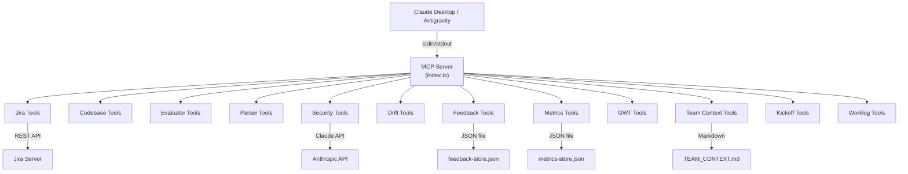

# 🔍 Phân tích Source Code: vnpt-dev-agent

## Tổng quan

**vnpt-dev-agent** là một **MCP Server (Model Context Protocol)** được xây dựng bằng TypeScript, hoạt động như một "cầu nối thông minh" giữa **AI Assistant (Claude)** và **hệ sinh thái phát triển phần mềm của VNPT** — đặc biệt là Jira.

> **Mục đích cốt lõi:** Cung cấp ~27 tools cho Claude Desktop/Antigravity để tự động hóa toàn bộ quy trình phát triển phần mềm — từ nhận task, phân tích, code, đến logwork và feedback.

---

## Kiến trúc hệ thống



## Tech Stack

| Thành phần | Công nghệ |
|---|---|
| Runtime | Node.js (ESM) |
| Language | TypeScript 5.6 |
| MCP SDK | `@modelcontextprotocol/sdk` ^1.0.0 |
| HTTP Client | `axios` (Jira API), native `fetch` (Claude API) |
| Validation | `zod` ^3.23 |
| Storage | JSON files (feedback, metrics), Markdown (team context) |
| Transport | StdioServerTransport (stdin/stdout pipe) |

---

## 13 Modules — Chi tiết

### 1. 📌 `jira/` — Jira Integration (6 tools)

Giao tiếp trực tiếp với Jira REST API.

| Tool | Chức năng |
|---|---|
| `list_my_open_issues` | Lấy danh sách issues OPEN được assign cho user |
| `get_issue_detail` | Đọc chi tiết 1 issue (auto-check drift) |
| `log_work` | Ghi nhận thời gian làm việc |
| `update_issue_status` | Chuyển trạng thái (Open → In Progress → Done) |
| `get_available_transitions` | Xem các transition có thể dùng |
| `create_issue` | Tạo issue/sub-task mới |

**Điểm đặc biệt:** `get_issue_detail` tự động tính **drift warning** (heuristic) — cảnh báo khi task cũ, description lạc hậu.

---

### 2. 🔍 `codebase/` — Codebase Reader (5 tools)

Tìm kiếm và đọc file trong Angular monorepo.

| Tool | Chức năng |
|---|---|
| `find_by_name` | Tìm file theo tên class/component/service |
| `search_keyword` | Tìm keyword trong toàn bộ nội dung file |
| `read_module` | Đọc toàn bộ 1 folder/module |
| `detect_files_from_task` | **Tự động** phân tích Jira task → trích keywords → tìm file liên quan |
| `rank_context_files` | Dùng Claude API để semantic-rank file theo độ liên quan |

**Điểm đặc biệt:** `detect_files_from_task` trích xuất PascalCase, camelCase, kebab-case từ description → search codebase → trả về top 8 file liên quan nhất.

---

### 3. 📊 `evaluator/` — Task Complexity Evaluator (1 tool)

| Tool | Chức năng |
|---|---|
| `evaluate_task_complexity` | Thu thập data + security signals → trả về cho Claude tự đánh giá clarity, complexity, AI risk, ước tính giờ |

**Không gọi external API** — chỉ trả raw data để Claude đang chat tự phân tích.

---

### 4. 📋 `parser/` — Description Parser (2 tools)

Parse description Jira theo format chuẩn VNPT.

| Tool | Chức năng |
|---|---|
| `parse_description` | Parse `[AI_METADATA]`, scenarios GWT, `[DONE_WHEN]` checklist → structured data |
| `check_format_compliance` | Kiểm tra description có đúng template VNPT → grade A-F |

**Hỗ trợ 4 loại issue:** Task, Bug, Story, Sub-task — mỗi loại có template riêng.

---

### 5. 🔐 `security/` — Security Analysis (2 tools)

Phát hiện vùng nhạy cảm bảo mật trong task.

| Tool | Chức năng |
|---|---|
| `check_security_flag` | Phân tích keywords → detect 7 security domains → trả về flag level (CRITICAL/HIGH/MEDIUM/NONE) |
| `security_review_checklist` | Gọi Claude API → sinh checklist bảo mật cụ thể cho task |

**7 Security domains:** Authentication, Authorization, Token Management, Sensitive Data (PII), XSS Risk, Input Validation, API Integration.

---

### 6. 🔄 `drift/` — Description Drift Detection (2 tools)

Phát hiện requirement đã thay đổi qua comments nhưng description chưa cập nhật.

| Tool | Chức năng |
|---|---|
| `check_description_drift` | Phân tích signals: tuổi task, comments mới, keywords thay đổi → drift score |
| `extract_latest_requirements` | Đọc description + TẤT CẢ comments → trả về cho Claude tổng hợp requirement thực tế |

---

### 7. 📝 `feedback/` — Feedback Loop (3 tools)

Hệ thống học hỏi theo thời gian — lưu feedback sau mỗi task.

| Tool | Chức năng |
|---|---|
| `submit_task_feedback` | Ghi feedback: code quality, estimation accuracy, what worked/failed, tribal knowledge |
| `get_feedback_insights` | Phân tích patterns: lỗi lặp lại, estimation bias, loại task AI tốt/kém |
| `list_feedback_history` | Xem lịch sử feedback, filter theo tag/thời gian |

**Storage:** [feedback-store.json](file:///d:/learn/vnpt-dev-agent/feedback-store.json) — local JSON file.

---

### 8. 📈 `metric-stores/` — Quantitative Metrics (3 tools)

Track ROI thực tế của hệ thống AI — khác feedback (định tính), metrics là **định lượng**.

| Tool | Chức năng |
|---|---|
| `track_metric` | Ghi cycle time, AI revision rate, estimation accuracy, security/drift issues |
| `get_metrics_report` | Báo cáo tổng quan: success rate, avg quality, sprint comparison |
| `get_metrics_dashboard` | Render HTML dashboard với Chart.js — visualize trực quan |

**Storage:** [metrics-store.json](file:///d:/learn/vnpt-dev-agent/metrics-store.json) — local JSON file.

---

### 9. ✍️ `gwt/` — GWT Description Generator (2 tools)

Cải thiện description mơ hồ thành format Given/When/Then chuẩn.

| Tool | Chức năng |
|---|---|
| `generate_gwt_description` | Trả về description + hướng dẫn để Claude tự sinh GWT |
| `validate_description_quality` | Trả về description + prompts để Claude chấm điểm specificity, completeness, testability |

---

### 10. 📚 `team-context/` — Tribal Knowledge Manager (2 tools)

Quản lý kiến thức ngầm định (tribal knowledge) của team.

| Tool | Chức năng |
|---|---|
| `get_team_context` | Đọc `TEAM_CONTEXT.md` — auto-filter sections liên quan theo task description |
| `update_team_context` | Thêm entry mới vào file (API gotchas, forbidden patterns, workarounds...) |

**11 sections:** SERVICE_RULES, API_GOTCHAS, FORBIDDEN_PATTERNS, PREFERRED_PATTERNS, NAMING_CONVENTIONS, KNOWN_ISSUES, TEMPORARY_WORKAROUNDS, SECURITY_RULES, TESTING_RULES, DEPENDENCIES, TEAM_GLOSSARY.

---

### 11. 🚀 `kick-off/` — Task Kickoff Wizard (1 tool)

| Tool | Chức năng |
|---|---|
| `task_kickoff` | **Entry point cho mọi task.** Đọc Jira → phân tích nhanh (drift, security, format) → trả về bộ câu hỏi có cấu trúc để Claude hỏi user tuần tự |

User chỉ cần nói _"làm task VNPTAI-123"_ — tool lo phần còn lại.

---

### 12. 📝 `gen-logwork/` — Worklog Generator (1 tool)

| Tool | Chức năng |
|---|---|
| `generate_worklog` | Tự động sinh nội dung logwork từ: `[DONE_WHEN]` checklist, scenario names, file đã sửa gần đây, WHERE context. **Không gọi AI API.** |

---

## Workflow tổng thể

```
User: "Làm task VNPTAI-123"
      │
      ▼
[task_kickoff] ─── Đọc Jira, phân tích nhanh, trả bộ câu hỏi
      │
      ▼
[parse_description] ─── Parse description → structured data
      │
      ▼
[get_team_context] ─── Inject tribal knowledge
      │
      ▼
[check_security_flag] ─── Nếu liên quan security
      │
      ▼
[evaluate_task_complexity] ─── Đánh giá effort, rủi ro
      │
      ▼
[detect_files_from_task] ─── Tìm file context tự động
      │
      ▼
    IMPLEMENT
      │
      ▼
[generate_worklog] ─── Sinh nội dung logwork
[log_work] ─── Submit lên Jira
      │
      ▼
[submit_task_feedback] ─── Ghi feedback để học hỏi
[track_metric] ─── Track metrics định lượng
```

## Đặc điểm thiết kế nổi bật

1. **"Data provider, not decision maker"** — Nhiều tools (evaluator, gwt, drift) trả về raw data + hướng dẫn cho Claude tự phân tích, thay vì gọi Claude API riêng. Tiết kiệm token và tận dụng Claude đang chat.

2. **Tự động hóa triệt để** — Từ nhận task → phân tích → tìm file → implement → logwork → feedback. User chỉ cần nói 1 câu.

3. **Learning loop** — Feedback + Metrics stores cho phép hệ thống cải thiện theo thời gian. AI không lặp lại lỗi cũ.

4. **Security-first** — 7 security domains, auto-detect, sinh checklist bảo mật trước khi merge.

5. **Drift detection** — Giải quyết vấn đề thực tế: requirement thay đổi qua comments nhưng description Jira không cập nhật.

6. **Description quality gate** — Format compliance checker + GWT generator đảm bảo input chất lượng cao trước khi AI implement.
